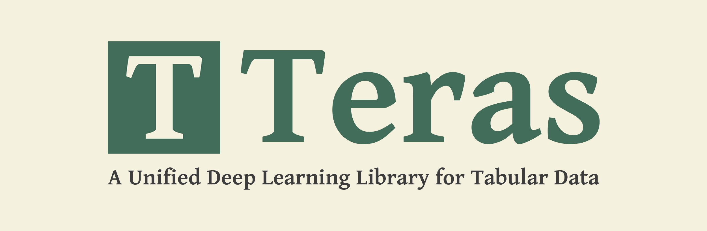

# Teras — A Unified Deep Learning Library for Tabular Data



Teras (short for Tabular Keras) is a unified deep learning library for Tabular Data that aims to be your one stop for everything related to deep learing with tabular data.

It provides state of the art layers, models and arhitectures for all purposes, be it classification, regression or even data generation and imputation using state of the art deep learning architectures. 

It also includes Preprocessing, Encoding and (Categorical and Numerical) Embedding layers. 

While these state of the art architectures can be quite sophisticated, Teras, thanks to the incredible design of Keras, abstracts away all the complications and sophistication and makes it easy as ever to access those models and put them to use.

Not only that, everything available is highly customizable and modular, allowing for all variety of use cases.

## Installation:
You can install Teras using pip as follows,
```
pip install teras
```

## Getting Started
Read our [Getting Started Guide](https://teras.readthedocs.io/en/latest/getting_started.html) to...*drum roll* get started with Teras.


## Documentation:
You can access the documentation on ReadTheDocs.io: https://teras.readthedocs.io/en/latest/index.html

## Usage
Teras provides two API for usage to satiate different levels of flexibility and accessibility needs:
1. **Parametric API**: This is the default API, where user specifies values for parameters that are used in construction of any sub-layers or models within the architecture.
```
from teras.models import TabNetClassifier

model = TabNetClassifier(num_classes=2, features_metadata=features_metadata)
```
2. **LayerFlow API**: It maximizes flexibility and minimizes interface. Here, the user can pass any sub-layers or models instances as arguments to the given architecture (model/layer). It can be accessed through `teras.layerflow`
Note that, there're no `<architecture>Classifier` or `<architecture>Regressor` model classes, but just one model class, which accepts a `head` layer that decides the model's final purpose.
```
from teras.layerflow.models import TabNet
from teras.layers import TabNetEncoder, CategoricalFeatureEmbedding, ClassificationHead

embedding = CategoricalFeatureEmbedding(features_metadata, embedding_dim=1)     # TabNet requires embedding_dim to be 1
encoder = TabNetEncoder(input_dim=input_dim)
head = ClassificationHead(num_classes=2)
model = TabNet(input_dim=input_dim,
               features_metadata=features_metadata,
               categorical_feature_embedding=embedding,
               encoder=encoder,
               head=head)
```
You can read more about the difference between the two in the Teras APIs section in the [Getting Started Guide](https://github.com/KhawajaAbaid/teras/blob/main/tutorials/getting_started.ipynb).

## Main Teras Modules
Teras offers following main modules:

1. `teras.layerflow`: It is the LayerFlow API, offering maximum flexibility with minimal interface. It's an alternative to the default Parametric API. You can read more about the difference between the two in the **Teras APIs** section in the [Getting Started Guide](https://teras.readthedocs.io/en/latest/getting_started.html).
2. `teras.layers`: It contains all the layers for all of the architectures offered by Teras.
3. `teras.models`: It contains all of the models of all the architectures types, be it Classificaiton, Regresssion etc offered by Teras.
4. `teras.generative`: It contains state of the art models for Data Generation. (Currently it offers `CTGAN` and `TVAE`).
5. `teras.impute`: It contains state of the art models for Data Imputation. (Currently it offers `GAIN` and `PCGAIN`)
6. `teras.preprocessing`: It offers preprocessing classes for data transformation and data sampling that are required by highly sophisticated models specifically the data generation and imputation models.
7. `teras.ensemble`: It is a work in progress and aims to offers ensembling techniques making it easier than ever to ensemble your deep learning models, such as using Bagging or Stacking. (Currently it offers very basic version of these.)
8. `teras.utils`: It contains useful utility functions making life easier for Teras users
9. `teras.losses`: It contains custom losses for various architectures.

## Motivation
The main purposes of Teras are to:
1. Provide a uniform interface for all the different proposed architectures.
2. Further bridge the gap between research and application.
3. Be a one-stop for everything concerning deep learning for tabular data.
4. Accelerate research in tabular domain of deep learning by making it easier for researchers to access, use and experiment with exisiting architectures — saving them lots of valuable time.


## Support
If you find Teras useful, consider supporting the project. I've been working on this for the past ~3 months full time and plan to continue to do so. I also have many future plans for it but my current laptop is quite old which makes it impossible for me to test highly demanding workflows let alone rapidly test and iterate. So your support will be very vital in the betterment of this project.
Thank you!

[](https://www.buymeacoffee.com/KhawajaAbaid)
[](https://www.patreon.com/KhawajaAbaid)
